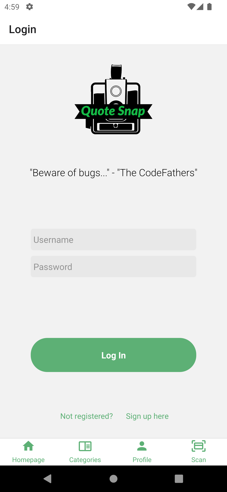

# Quotes Snap

## Introduction

QuoteSnap is an app for Android devices that allows users to take a photo of any inspirational text they see. The app will then use OCR technology to recognise and extract the text.

The user can then crop the photo to ensure only the text they want is scanned. Finally, the user can add additional details regarding the quote, such as Author, Category and Origin, before saving it to the database.

## Technologies

We built this app using React-Native, MongoDB and Expo.

## Setup Android Studio

1. Download and install [Android Studio](https://developer.android.com/codelabs/basic-android-kotlin-compose-install-android-studio#0)
2. Create an AVD via 'Virtual Device Manager'
3. Ensure to setup your webcam in the 'Advanced Settings' to enable your emulator to use the camera.

## Setup QuoteSnap

1. Clone repo to your local machine
2. `cd` into the cloned repo
3. Run `npm install`
4. Run `npx expo run:android`
5. Press 's' to switch from 'Expo Go' to the 'development build'
6. Run `npm start`
7. Press 'a' to load on your Android Emulator

## Created by

- [Steven Seo](https://github.com/holyseo)
- [Renato Cipolla](https://github.com/Onion1994)
- [Jahid Hassan](https://github.com/MJahidH)
- [Dominic Malloy](https://github.com/Dominic20227)
- [Jamie Harper](https://github.com/jamiemharper98)
- [Mike Francis](https://github.com/mikef80/)

## Screenshots

